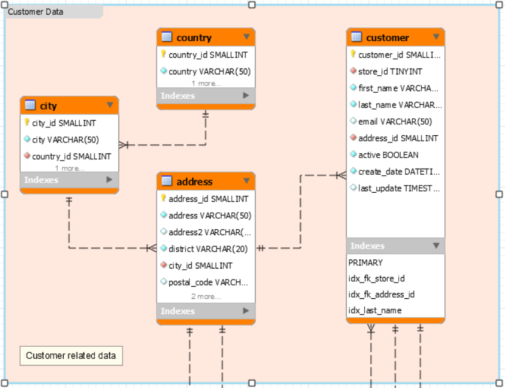

# Requêtes base de données Sakila

## Cours 19 mars 2019

1. Sélectionner les `customer` (first_name, last_name, create_date et last_update) avec les dates au format français (jj/mm/yyyy).

2. Sélectionner les `customer` (first_name, last_name et active); la propriété active doit être sous le format OUI/NON (OUI=1 et NON=0).

3. Sélectionner les 10 premiers et les 10 derniers enregistrements de la table `country` (ne pas utiliser la clause where).

4. Sélectionner tous `country`et leurs `city`(country et city); 1 ligne = 1 `country` et ses `city` séparées par une virgule.

5. Sélectionner les `country`(country) où les `customer` ne sont pas actifs, éviter les doublons.

